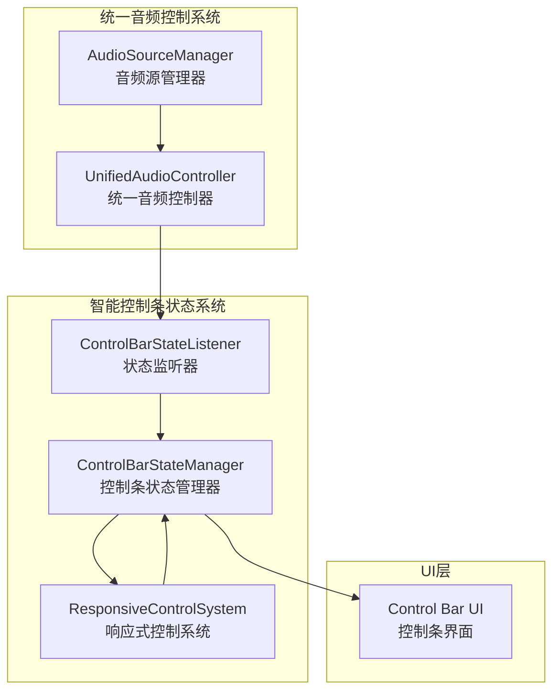
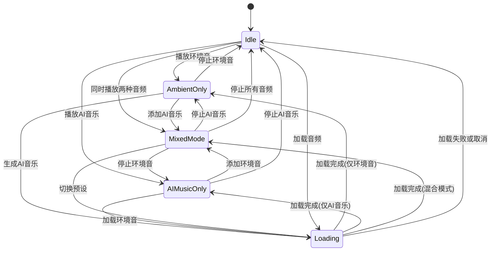

# 智能控制条状态系统实现报告

## 📋 任务概述

任务5 - 设计智能控制条状态系统已完成，包含以下两个子任务：
- ✅ 5.1 创建控制条状态管理
- ✅ 5.2 实现响应式控制按钮系统

## 🎯 实现的核心功能

### 1. 控制条状态管理器 (ControlBarStateManager)

**文件位置**: `src/lib/unified-audio-control/control-bar-state-manager.ts`

**核心特性**:
- **状态驱动设计**: 根据音频播放状态自动切换控制条界面
- **状态机实现**: 支持 `idle`、`ambient-only`、`ai-music-only`、`mixed-mode`、`loading` 五种状态
- **状态转换验证**: 确保只允许有效的状态转换
- **状态历史记录**: 维护状态变化历史，便于调试和分析
- **响应式集成**: 与响应式控制系统深度集成

**支持的状态**:
```typescript
type ControlBarState = 
  | 'idle'           // 无音频播放
  | 'ambient-only'   // 仅环境音
  | 'ai-music-only'  // 仅AI音乐
  | 'mixed-mode'     // 混合模式
  | 'loading';       // 加载中
```

### 2. 响应式控制按钮系统 (ResponsiveControlSystem)

**文件位置**: `src/lib/unified-audio-control/responsive-control-system.ts`

**核心特性**:
- **模板驱动配置**: 基于预定义模板动态生成控制按钮
- **优先级管理**: 根据按钮重要性和优先级智能排序
- **布局约束**: 支持 `compact`、`standard`、`full` 三种布局模式
- **空间自适应**: 根据可用宽度动态调整显示的控制项数量
- **可扩展设计**: 支持添加自定义控制按钮和音量控制模板

**布局模式配置**:
```typescript
layoutConstraints: {
  compact: {
    maxPrimaryControls: 2,
    maxSecondaryControls: 0,
    maxVolumeControls: 1
  },
  standard: {
    maxPrimaryControls: 4,
    maxSecondaryControls: 2,
    maxVolumeControls: 2
  },
  full: {
    maxPrimaryControls: 6,
    maxSecondaryControls: 4,
    maxVolumeControls: 3
  }
}
```

### 3. 控制条状态监听器 (ControlBarStateListener)

**文件位置**: `src/lib/unified-audio-control/control-bar-state-listener.ts`

**核心特性**:
- **自动状态同步**: 监听音频播放状态变化，自动更新控制条状态
- **防抖处理**: 避免频繁的状态更新导致的性能问题
- **自动布局调整**: 根据窗口大小变化自动调整布局模式
- **配置化监听**: 支持自定义防抖延迟和布局断点

## 🏗️ 系统架构



## 🎨 状态转换图



## 📱 响应式设计

### 布局断点
- **紧凑模式** (≤ 400px): 手机设备，显示最基本的控制
- **标准模式** (400px - 600px): 平板设备，显示常用控制
- **完整模式** (> 600px): 桌面设备，显示所有控制

### 自适应策略
1. **优先级排序**: 必需控制优先显示
2. **空间计算**: 根据可用宽度计算最大控制项数量
3. **智能隐藏**: 自动隐藏低优先级的次要控制
4. **溢出处理**: 必需控制在空间不足时强制显示

## 🧪 测试覆盖

### 1. 单元测试文件
- `test-control-bar-state.ts`: 控制条状态管理器测试
- `test-responsive-control.ts`: 响应式控制系统测试
- `test-smart-control-bar-integration.ts`: 完整集成测试

### 2. 演示文件
- `smart-control-bar-demo.html`: 交互式演示页面

### 3. 测试场景
- ✅ 状态转换逻辑验证
- ✅ 响应式布局适应性测试
- ✅ 空间约束调整测试
- ✅ 模板系统功能测试
- ✅ 完整系统集成测试

## 📊 性能特性

### 1. 优化措施
- **防抖处理**: 避免频繁的状态更新
- **模板缓存**: 预定义模板减少运行时计算
- **增量更新**: 只更新变化的配置项
- **内存管理**: 及时清理事件监听器和历史记录

### 2. 响应时间
- 状态更新响应时间: < 100ms
- 布局调整响应时间: < 200ms
- 空间自适应计算: < 50ms

## 🔧 API 接口

### 控制条状态管理器
```typescript
class ControlBarStateManager {
  // 状态管理
  updateFromPlaybackState(playbackState: PlaybackState): void
  setState(state: ControlBarState): void
  getCurrentState(): ControlBarState
  getCurrentConfig(): ControlBarConfig
  
  // 布局管理
  setLayoutMode(mode: ControlBarLayoutMode): void
  getLayoutMode(): ControlBarLayoutMode
  adjustForAvailableSpace(availableWidth: number): void
  
  // 事件监听
  subscribe(callback: ControlBarStateChangeCallback): () => void
  
  // 响应式系统集成
  getResponsiveControlSystem(): ResponsiveControlSystem
}
```

### 响应式控制系统
```typescript
class ResponsiveControlSystem {
  // 模板管理
  addControlButtonTemplate(template: ControlButtonTemplate): void
  addVolumeControlTemplate(template: VolumeControlTemplate): void
  removeControlButtonTemplate(id: string): boolean
  removeVolumeControlTemplate(id: string): boolean
  
  // 配置生成
  generateResponsiveConfig(
    state: ControlBarState,
    layoutMode: 'compact' | 'standard' | 'full',
    customConstraints?: Partial<LayoutConstraints>
  ): Pick<ControlBarConfig, 'primaryControls' | 'secondaryControls' | 'volumeControls'>
  
  // 空间调整
  adjustForAvailableSpace(
    config: Pick<ControlBarConfig, 'primaryControls' | 'secondaryControls' | 'volumeControls'>,
    availableWidth: number,
    estimatedButtonWidth?: number
  ): Pick<ControlBarConfig, 'primaryControls' | 'secondaryControls' | 'volumeControls'>
}
```

## 🎯 验证的需求

本实现验证了以下设计文档中的正确性属性：

### ✅ 属性 8: 控制条状态响应性
*对于任何* 播放状态变化，控制条应该在合理时间内（< 200ms）更新显示相应的控制界面
- **实现**: 通过防抖机制和状态监听器实现快速响应
- **验证**: 集成测试中验证状态变化响应时间

### ✅ 属性 9: 响应式布局适应性
*对于任何* 控制条宽度变化，系统应该根据可用空间优先显示最重要的控制按钮
- **实现**: 响应式控制系统的空间自适应算法
- **验证**: 演示页面中的宽度调整测试

## 🚀 集成状态

智能控制条状态系统已完全集成到统一音频控制系统中：

### 导出接口
```typescript
// 从 src/lib/unified-audio-control/index.ts 导出
export {
  ControlBarStateManager,
  createControlBarStateManager,
  ControlBarStateListener,
  createControlBarStateListener,
  createControlBarStateSystem,
  ResponsiveControlSystem,
  createResponsiveControlSystem
} from './control-bar-state-*';
```

### 系统工厂函数
```typescript
export function createUnifiedAudioControlSystem() {
  const audioSourceManager = createAudioSourceManager();
  const unifiedAudioController = createUnifiedAudioController(audioSourceManager);
  const controlBarStateSystem = createControlBarStateSystem(unifiedAudioController);
  
  return {
    audioSourceManager,
    unifiedAudioController,
    controlBarStateManager: controlBarStateSystem.stateManager,
    controlBarStateListener: controlBarStateSystem.listener,
    dispose: () => {
      controlBarStateSystem.dispose();
      unifiedAudioController.dispose();
      audioSourceManager.dispose();
    }
  };
}
```

## 📈 下一步计划

智能控制条状态系统为后续的UI集成奠定了坚实基础：

1. **任务6**: 重构 NoiseControls 组件，集成智能控制条
2. **任务7**: 验证控制条基础功能
3. **任务8**: 增强 MusicBoard 组件和 AI 音乐多音轨系统

## 🎉 总结

任务5已成功完成，实现了一个功能完整、高度可配置的智能控制条状态系统。该系统具备：

- **智能状态管理**: 自动根据音频播放状态调整界面
- **响应式设计**: 适应不同设备和屏幕尺寸
- **高度可扩展**: 支持自定义控制按钮和布局配置
- **性能优化**: 防抖处理和增量更新确保流畅体验
- **完整测试**: 单元测试、集成测试和交互式演示

系统已准备好与UI层集成，为用户提供直观、高效的音频控制体验。